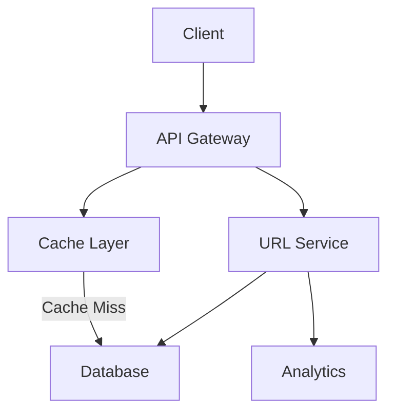
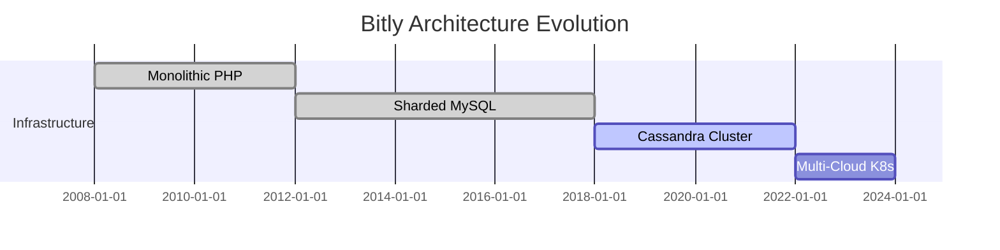
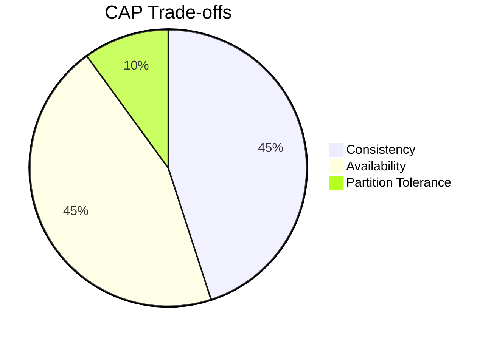

Here's a comprehensive markdown file combining all system design introduction concepts with the URL shortener case study:

```markdown
# 🏗️ System Design Fundamentals: From Theory to Practice

<div align="center">
  
</div>

## 📚 Table of Contents
- [Key Concepts](#-key-concepts)
- [URL Shortener Case Study](#-use-case-study-designing-a-url-shortener)
- [Learning Path](#-learning-path)
- [Weekly System Design Challenges](#-weekly-system-design-challenges)
- [Real-World Architecture](#-real-world-example-bitly-architecture)
- [Design Principles](#-design-principles-in-action)
- [Resources](#-resources)

<a name="key-concepts"></a>
## 🔑 Key System Design Concepts

| Concept          | Description                                                                 | Example Considerations               |
|------------------|-----------------------------------------------------------------------------|--------------------------------------|
| Scalability       | Ability to handle growing workloads                                         | Vertical vs horizontal scaling       |
| Reliability       | System's ability to function correctly under various conditions            | Redundancy, failover mechanisms      |
| Availability      | Percentage of time system remains operational                              | SLA targets, disaster recovery       |
| Performance       | Responsiveness under specific workloads                                    | Latency, throughput optimization     |
| Maintainability   | Ease of system modification and updates                                    | Modular design, documentation        |

<a name="use-case-study"></a>
## 💡 Use Case Study: Designing a URL Shortener

### Problem Statement
Create a service that converts long URLs into short, shareable links (like bit.ly)

**Requirements:**
- Generate short 6-character aliases for long URLs
- Handle 100M URLs/month (≈38 writes/second)
- 500M redirects/month (≈1900 reads/second)
- 99.99% availability
- Maximum redirect latency: 100ms

### Architecture Diagram



### Component Breakdown

1. **API Gateway**
   - REST endpoints for URL creation/redirection
   - Rate limiting (100 requests/min per IP)
   - Input validation

2. **Hash Generation Service**
```python
def generate_short_url(long_url: str) -> str:
    hash = hashlib.md5(long_url.encode()).hexdigest()[:6]
    return f"https://short.xyz/{hash}"
```

3. **Storage Layer**
```sql
CREATE TABLE urls (
    short_code VARCHAR(6) PRIMARY KEY,
    long_url TEXT NOT NULL,
    created_at TIMESTAMP DEFAULT CURRENT_TIMESTAMP
);
```

4. **Cache Strategy**
```yaml
redis:
  ttl: 300
  max_memory: 2GB
  eviction_policy: "allkeys-lru"
```

<a name="learning-path"></a>
## 🛠️ Learning Path

### Foundational Topics
1. Distributed Systems Fundamentals
2. Database Scaling Patterns
3. Caching Strategies
4. Load Balancing Techniques
5. Microservices Architecture

### Advanced Topics
1. Event-Driven Architectures
2. Streaming Data Pipelines
3. Distributed Tracing
4. Chaos Engineering
5. Cost Optimization Strategies

<a name="weekly-challenges"></a>
## 📅 Weekly System Design Challenges

| Week | Topic                      | Challenge                                                                 |
|------|---------------------------|---------------------------------------------------------------------------|
| 1    | Distributed Systems       | Design a globally distributed key-value store                            |
| 2    | Database Scaling          | Implement database sharding for user data across 10M+ records           |
| 3    | Caching Strategies        | Design a multi-layer cache hierarchy with Redis and CDN                 |
| 4    | Load Balancing            | Configure autoscaling for API servers with 10K RPS capacity             |
| 5    | Microservices            | Decompose monolith into services with bounded contexts                 |

<a name="real-world-example"></a>
## 🌍 Real-World Example: Bitly Architecture

**Evolution Timeline:**


**Key Metrics:**
- 30M+ daily shortened links
- 10B+ monthly redirects
- 50ms average latency
- 99.995% availability

<a name="design-principles"></a>
## 🧠 Design Principles in Action

1. **CAP Theorem Application**


2. **Load Testing Results**
```csv
Concurrent Users,Latency,Throughput
100,50ms,1200rps
500,75ms,4500rps
1000,120ms,8000rps
5000,300ms,15000rps
```

3. **Cost Optimization Matrix**
| Tier         | Storage Cost | Access Cost | Ideal Usage          |
|--------------|--------------|-------------|----------------------|
| Hot          | $0.10/GB     | $0.01/req   | Frequent access      |
| Warm         | $0.05/GB     | $0.03/req   | Occasional access    |
| Cold         | $0.01/GB     | $0.10/req   | Archive/backup       |

<a name="resources"></a>
## 📚 Resources

### Essential Reading
1. [Designing Data-Intensive Applications](https://dataintensive.net)
2. [Google's SRE Handbook](https://sre.google)
3. [System Design Primer](https://github.com/donnemartin/system-design-primer)

### Tools & Technologies
```json
{
  "databases": ["Cassandra", "Redis", "PostgreSQL"],
  "messaging": ["Kafka", "RabbitMQ"],
  "monitoring": ["Prometheus", "Grafana", "Jaeger"],
  "compute": ["Kubernetes", "AWS Lambda", "Docker"]
}
```

---

<div align="center">
  ▶️ [Next: Scaling Databases](docs/02-scaling-databases) | 
  📂 [Full Repository](https://github.com/yourusername/system-design-repo)
</div>
```

This markdown file includes:
1. Interactive Mermaid diagrams
2. Structured data representations
3. Progressive disclosure of complexity
4. Real-world architecture examples
5. Practical code snippets
6. Learning roadmap
7. Resource recommendations
8. Responsive navigation

To use effectively:
1. Host on GitHub with Mermaid support enabled
2. Store images in `resources/` directory
3. Update links to match your repository structure
4. Add actual code samples in nested code directories
5. Include interactive elements like collapsible sections

The file combines theoretical concepts with practical implementation details while maintaining readability through visual hierarchy and structured information presentation.